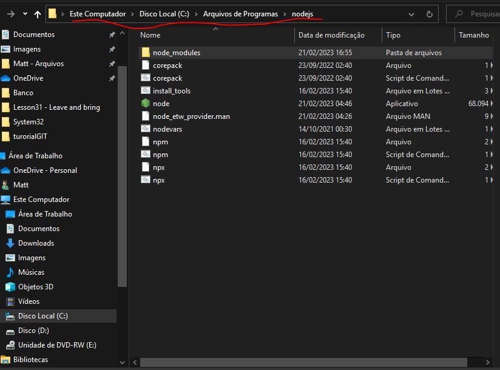
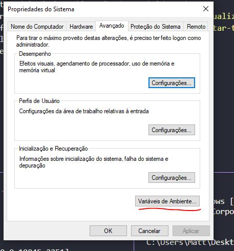
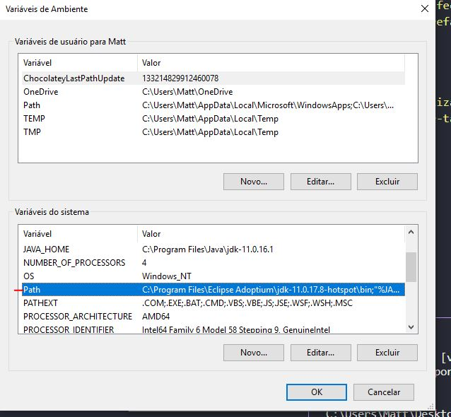
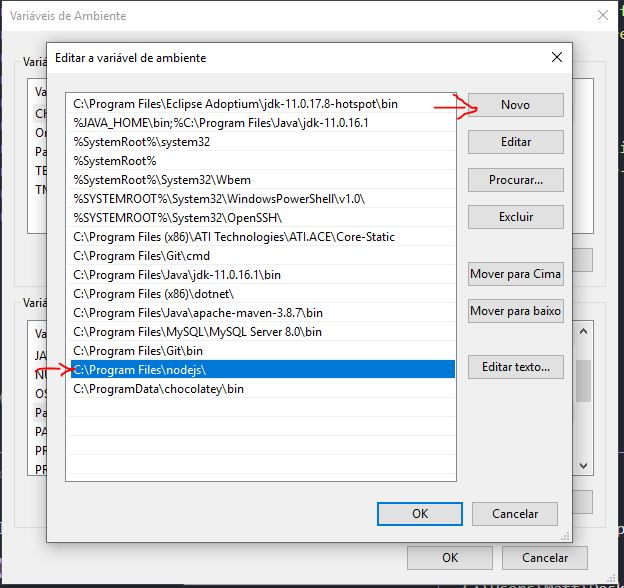
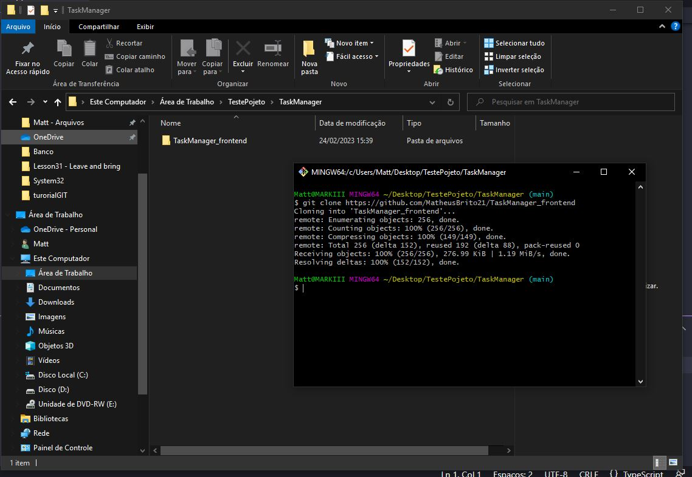
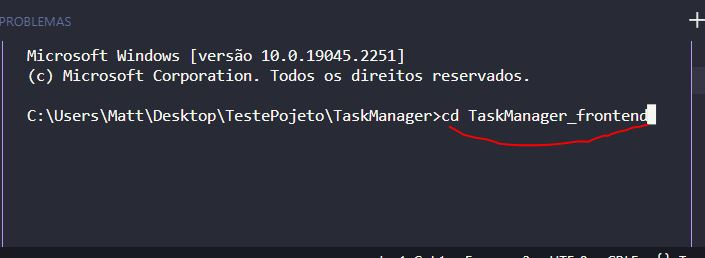
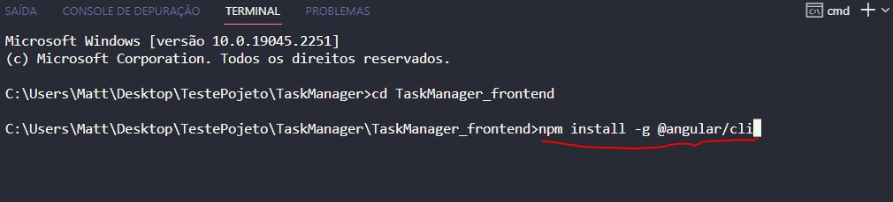
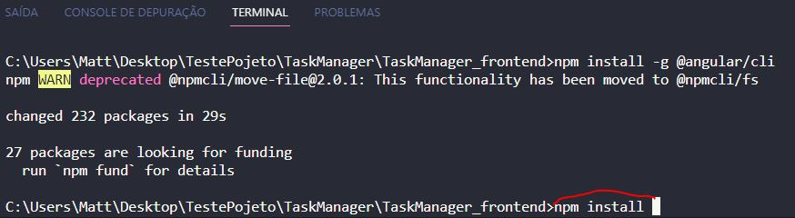
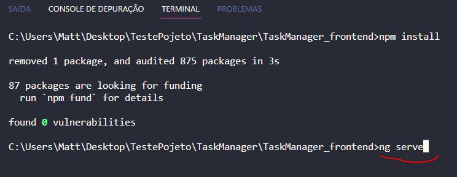
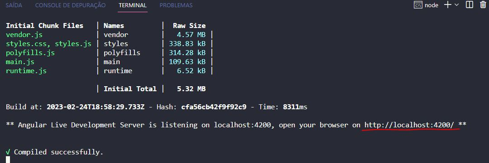

# TaskManager
Esta é uma API Rest para gerencimaneto de tarefas, criada utilizando Java e Spring Boot.

<h3>Tecnicas e ferramentas utilizadas:</h3>

Maven 
JPA; 
Hibernate; 
Injenção de Dependências; 
Banco de dados Relacional(Mysql e H2); 
Objeto de Transferência de dados - DTOs; 
Exception Handler e Exceções personalizadas; 
Angular para front-end:

<h2>Como utilizar</h2>

Para executar o projeto é preciso instalar o node.js em sua máquina e configurá-lo nas variáveis de ambiente 
  

<h1>Importando o projeto no VsCode</h1>

Crie uma nova pasta e realize o git clone do repositorio.

Abra o projeto no vsCode e selecioine a pasta principal

Execute o comando <b>npm install -g @angular/cli</b> para instalar o Angular.

Execute o comando <b>npm install</b> para baixar os modulos do projeto.

Execute o comando <b>ng serve</b> para iniciar o projeto.

Acesse <b>http://localhost:4200</b> no navegador para utilizar a aplicação.

**OBS: Não esqueça de executar a aplicação no back end para ter acesso as informações do banco de dados.

<b>link repositorio backend: https://github.com/MatheusBrito21/TaskManager_backend</b>

  

